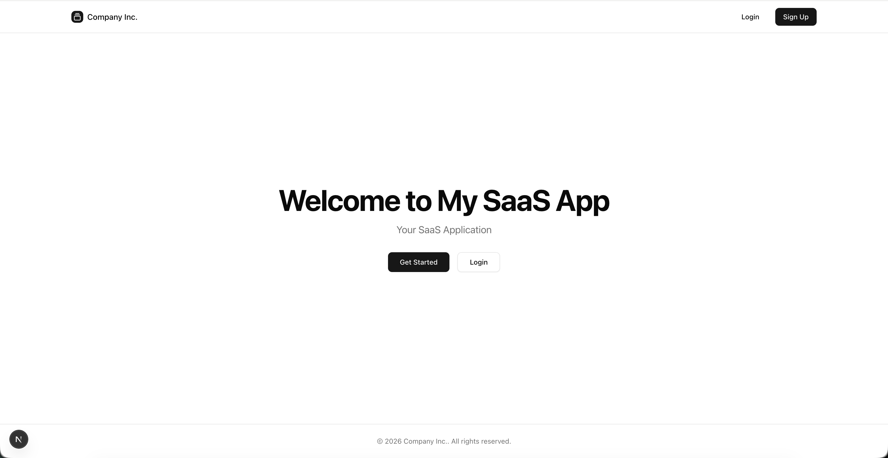
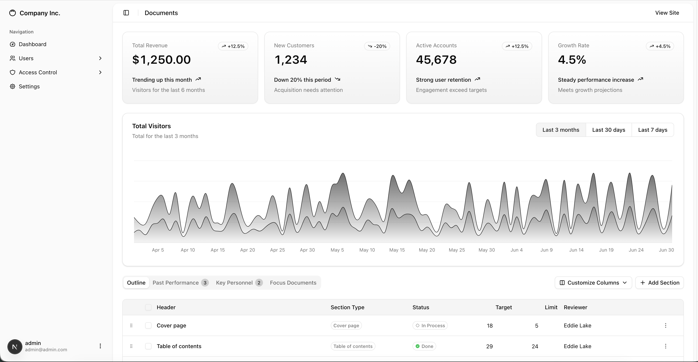

<div align="center">

  <a href="https://github.com/habibjutt/nextjs_boilerplate">
    
  </a>

  <h1>Next.js SaaS Boilerplate</h1>

  <p><strong>Ship your SaaS in days, not months.</strong></p>
  <p>The open-source, production-ready starter kit with auth, payments, admin dashboard, blog CMS, RBAC, email system, and 50+ components — so you can focus on what makes your product unique.</p>

  <p>
    <a href="https://github.com/habibjutt/nextjs_boilerplate/stargazers"></a>&nbsp;
    <a href="https://github.com/habibjutt/nextjs_boilerplate/network/members"></a>&nbsp;
    <a href="https://github.com/habibjutt/nextjs_boilerplate/blob/main/LICENSE"></a>&nbsp;
    <a href="https://github.com/habibjutt/nextjs_boilerplate/issues"></a>&nbsp;
    <a href="https://github.com/habibjutt/nextjs_boilerplate/pulls"></a>
  </p>

  <p>
    &nbsp;
    &nbsp;
    &nbsp;
    &nbsp;
    &nbsp;
    &nbsp;
    &nbsp;
    
  </p>

  <p>
    <a href="#-quick-start">Quick Start</a> •
    <a href="#-features">Features</a> •
    <a href="#-screenshots">Screenshots</a> •
    <a href="#-tech-stack">Tech Stack</a> •
    <a href="#-deployment">Deployment</a> •
    <a href="#-contributing">Contributing</a>
  </p>

</div>

<br />

> **Stop rebuilding the same SaaS infrastructure from scratch.** This boilerplate includes authentication (email, OAuth, 2FA), Stripe payments & subscriptions, a full admin dashboard, blog CMS, transactional email system, RBAC, and 50+ production-ready UI components — all wired together and ready to deploy.

<br />

## 📸 Screenshots

<div align="center">
  <table>
    <tr>
      <td align="center"><strong>🏠 Landing Page</strong></td>
      <td align="center"><strong>📊 Admin Dashboard</strong></td>
    </tr>
    <tr>
      <td></td>
      <td></td>
    </tr>
  </table>
</div>

<br />

## ✨ Features

### 🔐 Authentication & Security

| Feature | Description |
|---------|-------------|
| **Email & Password** | Secure signup/login with email verification |
| **OAuth** | One-click Google & GitHub social login |
| **Two-Factor Auth (2FA)** | TOTP-based 2FA with QR code setup |
| **OTP Verification** | Email-based one-time password verification |
| **Session Management** | Secure sessions with automatic token refresh |
| **Password Recovery** | Forgot password & reset password flow |
| **Rate Limiting** | IP-based rate limiting on auth endpoints |
| **Security Headers** | CSP, HSTS, X-Frame-Options, and more |
| **Audit Logging** | Track auth events, payments, and security incidents |
| **RBAC** | Granular role-based access control with custom permissions |

### 💳 Payments & Billing

| Feature | Description |
|---------|-------------|
| **Stripe Integration** | Full Stripe Checkout & Customer Portal |
| **Subscription Plans** | Starter, Professional, and Enterprise tiers |
| **Webhook Handling** | Idempotent webhook processing with event deduplication |
| **Billing Portal** | Self-service plan management for customers |
| **Payment Receipts** | Automatic HTML email receipts after payment |
| **Subscription Sync** | CLI tools to sync and verify subscription states |

### 🛠 Admin Dashboard

| Feature | Description |
|---------|-------------|
| **User Management** | List, create, edit, delete users with filters |
| **Blog CMS** | Rich text editor (Tiptap) with image support |
| **Role Management** | Create custom roles and assign permissions |
| **Permission System** | Fine-grained permissions for every feature |
| **Organization Support** | Multi-tenant org management with member roles |
| **Dashboard Analytics** | Interactive charts with Recharts |
| **Settings Panel** | App-wide configuration management |
| **Data Tables** | Sortable, filterable, paginated tables with drag-to-reorder columns |

### 📧 Email System

| Feature | Description |
|---------|-------------|
| **Transactional Email** | Nodemailer with SMTP support |
| **11 Email Templates** | Beautiful HTML templates for every event |
| **Welcome Email** | Sent after email verification |
| **OTP Email** | Verification codes with branded templates |
| **Password Reset** | Secure reset links with expiry |
| **Payment Receipts** | Detailed invoice-style receipts |
| **Subscription Updates** | Plan change & cancellation notifications |
| **Email Change** | Verification & notification for email updates |
| **Contact Form** | Auto-response to contact submissions |

### 🎨 UI & Design

| Feature | Description |
|---------|-------------|
| **50+ Components** | Full shadcn/ui library + custom components |
| **Dark Mode** | System, light, and dark theme toggle |
| **Responsive Design** | Mobile-first layouts across all pages |
| **Landing Page** | Hero, features, pricing, testimonials, FAQ sections |
| **Cookie Consent** | GDPR-compliant cookie consent banner |
| **Loading States** | Skeleton loaders and spinners throughout |
| **Error Handling** | Custom error boundaries, 404, and error pages |
| **Toast Notifications** | Sonner-based notification system |

### 📈 SEO & Analytics

| Feature | Description |
|---------|-------------|
| **SEO Optimized** | Dynamic sitemap.ts & robots.ts |
| **Open Graph** | OG and Twitter Card meta tags |
| **PostHog** | Product analytics integration |
| **Google Analytics** | GA4 measurement support |
| **Plausible** | Privacy-friendly analytics option |

### 🏗 Developer Experience

| Feature | Description |
|---------|-------------|
| **TypeScript** | Fully typed with strict mode |
| **Prisma ORM** | Type-safe database queries with migrations |
| **Zod Validation** | Runtime schema validation |
| **Server Actions** | 30+ server actions for all CRUD operations |
| **Server Components** | RSC-first architecture, minimal client JS |
| **API Keys** | Generate and manage API keys per user |
| **CLI Scripts** | Admin setup, plan seeding, subscription sync |
| **ESLint** | Pre-configured linting |

<br />

## 🚀 Quick Start

### Prerequisites

- **Node.js** 18+ ([download](https://nodejs.org))
- **PostgreSQL** database ([Neon](https://neon.tech), [Supabase](https://supabase.com), or local)
- **Stripe** account ([sign up](https://stripe.com)) — for payments

### 1. Clone & install

```bash
git clone https://github.com/habibjutt/nextjs_boilerplate.git
cd nextjs_boilerplate
npm install
```

### 2. Configure environment

```bash
cp .env.example .env
```

Edit `.env` with your credentials — see [Environment Variables](#-environment-variables) for the full list.

### 3. Set up the database

```bash
npx prisma generate
npx prisma db push
```

### 4. Create your admin user

```bash
npm run setup:admin
```

### 5. Seed pricing plans

```bash
npm run seed:plans
```

### 6. Start developing

```bash
npm run dev
```

Open **[http://localhost:3000](http://localhost:3000)** — your SaaS is running! 🎉

<br />

## 🛠 Tech Stack

<table>
  <tr>
    <td align="center" width="96"><br /><strong>Next.js 16</strong><br /><sub>App Router</sub></td>
    <td align="center" width="96"><br /><strong>React 19</strong><br /><sub>Server Components</sub></td>
    <td align="center" width="96"><br /><strong>TypeScript 5</strong><br /><sub>Strict Mode</sub></td>
    <td align="center" width="96"><br /><strong>Tailwind v4</strong><br /><sub>Utility-First CSS</sub></td>
    <td align="center" width="96"><br /><strong>Prisma 7</strong><br /><sub>Type-Safe ORM</sub></td>
    <td align="center" width="96"><br /><strong>PostgreSQL</strong><br /><sub>Database</sub></td>
  </tr>
  <tr>
    <td align="center" width="96"><br /><strong>Stripe</strong><br /><sub>Payments</sub></td>
    <td align="center" width="96"><br /><strong>Better Auth</strong><br /><sub>Authentication</sub></td>
    <td align="center" width="96"><br /><strong>Nodemailer</strong><br /><sub>Transactional Email</sub></td>
    <td align="center" width="96"><br /><strong>shadcn/ui</strong><br /><sub>UI Components</sub></td>
    <td align="center" width="96"><br /><strong>Zod</strong><br /><sub>Validation</sub></td>
    <td align="center" width="96"><br /><strong>Tiptap</strong><br /><sub>Rich Text Editor</sub></td>
  </tr>
</table>

<br />

## 📋 Environment Variables

Create a `.env` file from the template:

```bash
cp .env.example .env
```

<details>
<summary><strong>Click to expand full environment variable reference</strong></summary>

| Variable | Required | Description |
|----------|----------|-------------|
| **App** | | |
| `NEXT_PUBLIC_APP_NAME` | ✅ | Your app name (shown in UI & emails) |
| `NEXT_PUBLIC_APP_URL` | ✅ | Public URL (e.g., `http://localhost:3000`) |
| `NEXT_PUBLIC_APP_DESCRIPTION` | ❌ | App description for meta tags |
| **Database** | | |
| `DATABASE_URL` | ✅ | PostgreSQL connection string |
| **Authentication** | | |
| `BETTER_AUTH_SECRET` | ✅ | Secret key (min 32 chars) for signing tokens |
| `BETTER_AUTH_URL` | ✅ | Auth base URL (same as app URL) |
| **Stripe** | | |
| `STRIPE_SECRET_KEY` | ✅ | Stripe secret key (`sk_test_...`) |
| `STRIPE_WEBHOOK_SECRET` | ✅ | Webhook signing secret (`whsec_...`) |
| `NEXT_PUBLIC_STRIPE_PUBLISHABLE_KEY` | ✅ | Publishable key (`pk_test_...`) |
| **Email / SMTP** | | |
| `SMTP_HOST` | ✅ | SMTP server host |
| `SMTP_PORT` | ✅ | SMTP port (usually `587`) |
| `SMTP_USER` | ✅ | SMTP username |
| `SMTP_PASSWORD` | ✅ | SMTP password |
| `EMAIL_FROM` | ✅ | Sender email address |
| **OAuth (optional)** | | |
| `GOOGLE_CLIENT_ID` | ❌ | Google OAuth client ID |
| `GOOGLE_CLIENT_SECRET` | ❌ | Google OAuth client secret |
| `GITHUB_CLIENT_ID` | ❌ | GitHub OAuth client ID |
| `GITHUB_CLIENT_SECRET` | ❌ | GitHub OAuth client secret |
| **Analytics (optional)** | | |
| `NEXT_PUBLIC_POSTHOG_KEY` | ❌ | PostHog project API key |
| `NEXT_PUBLIC_GA_MEASUREMENT_ID` | ❌ | Google Analytics 4 measurement ID |
| `NEXT_PUBLIC_PLAUSIBLE_DOMAIN` | ❌ | Plausible analytics domain |

</details>

<br />

## 📁 Project Structure

```
nextjs_boilerplate/
├── app/                          # Next.js App Router
│   ├── (protected)/              # 🔒 Auth-required routes
│   │   ├── (admin)/              # Admin panel
│   │   │   ├── dashboard/        #   ├── Analytics dashboard
│   │   │   ├── users/            #   ├── User management (CRUD)
│   │   │   ├── blogs/            #   ├── Blog CMS (Tiptap editor)
│   │   │   ├── roles/            #   ├── Role management
│   │   │   ├── permissions/      #   ├── Permission management
│   │   │   ├── organizations/    #   ├── Organization management
│   │   │   ├── settings/         #   └── App settings
│   │   │   └── account/          #   └── Admin account
│   │   ├── profile/              # User profile & settings
│   │   ├── billing/              # Subscription & billing
│   │   └── payment/              # Payment success/cancel
│   ├── api/                      # API routes
│   │   ├── auth/[...all]/        #   ├── Better Auth endpoints
│   │   ├── webhooks/stripe/      #   ├── Stripe webhooks
│   │   ├── api-keys/             #   ├── API key management
│   │   └── health/               #   └── Health check
│   ├── blog/                     # 📝 Public blog
│   ├── login/                    # Auth pages
│   ├── signup/                   #
│   ├── forgot-password/          #
│   ├── reset-password/           #
│   ├── contact/                  # Contact form
│   ├── privacy/                  # Legal pages
│   ├── terms/                    #
│   └── page.tsx                  # 🏠 Landing page
│
├── components/                   # React components
│   ├── ui/                       # 40+ shadcn/ui components
│   ├── login-form.tsx            # Auth form components
│   ├── signup-form.tsx           #
│   ├── billing-client.tsx        # Billing management
│   ├── pricing-cards.tsx         # Pricing display
│   ├── data-table.tsx            # Reusable data table
│   ├── tiptap-editor.tsx         # Rich text editor
│   ├── two-factor-settings.tsx   # 2FA setup
│   ├── api-keys-manager.tsx      # API key management
│   └── ...                       # 20+ more components
│
├── actions/                      # Server Actions
│   ├── users/                    # User CRUD (8 actions)
│   ├── payments/                 # Stripe operations (8 actions)
│   ├── blogs/                    # Blog CRUD (5 actions)
│   ├── roles/                    # Role management
│   ├── permissions/              # Permission management
│   ├── settings/                 # Settings actions
│   └── contact/                  # Contact form handler
│
├── lib/                          # Core libraries
│   ├── auth.ts                   # Better Auth config
│   ├── prisma.ts                 # Prisma client
│   ├── email-service.ts          # Email sending
│   ├── email-templates/          # 11 HTML email templates
│   ├── payments/stripe/          # Stripe config & plans
│   ├── security/                 # Rate limiter, audit logger
│   ├── permissions.ts            # RBAC helpers
│   └── config.ts                 # App configuration
│
├── hooks/                        # Custom React hooks
│   ├── use-mobile.ts             # Mobile detection
│   └── use-permission.ts         # Permission checking
│
├── scripts/                      # CLI utilities
│   ├── create-admin.ts           # Create admin user
│   ├── seed-plans.ts             # Seed Stripe plans
│   ├── sync-subscriptions.ts     # Sync subscription states
│   └── ...                       # More utilities
│
├── prisma/
│   └── schema.prisma             # Database schema
│
└── types/                        # TypeScript definitions
```

<br />

## 🚀 Deployment

### ▲ Vercel (Recommended)

The fastest way to deploy:

1. Push your code to GitHub
2. Import the repository on [vercel.com/new](https://vercel.com/new)
3. Add your environment variables in the Vercel dashboard
4. Deploy — done! ✅

[](https://vercel.com/new/clone?repository-url=https://github.com/habibjutt/nextjs_boilerplate)

### 🐳 Docker

```bash
docker build -t my-saas-app .
docker run -p 3000:3000 --env-file .env my-saas-app
```

### 🔧 Self-Hosted

```bash
npm run build
npm run start
```

> **Tip:** Set up a reverse proxy (Nginx/Caddy) with SSL for production.

<br />

## 📝 Admin Setup

After deploying, create your first admin user:

```bash
# Option 1: Use the CLI script
npm run setup:admin

# Option 2: Sign up normally, then promote via Prisma Studio
npx prisma studio
# → Navigate to the User table → Set isAdmin to true
```

### Available CLI Scripts

| Script | Description |
|--------|-------------|
| `npm run setup:admin` | Create an admin user |
| `npm run seed:plans` | Seed Stripe subscription plans |
| `npm run check:subscriptions` | Verify subscription states |
| `npm run sync:subscriptions` | Sync subscriptions with Stripe |
| `npm run setup:blog-permissions` | Set up blog-related permissions |
| `npm run studio` | Open Prisma Studio (database GUI) |

<br />

## 🔐 Security

This boilerplate takes security seriously:

- 🛡 **Security Headers** — CSP, HSTS, X-Frame-Options, X-Content-Type-Options
- 🚦 **Rate Limiting** — IP-based rate limiting on all auth and API endpoints
- 🔑 **RBAC** — Fine-grained role-based access control
- 📋 **Audit Logging** — Track payments, security events, and user actions
- 🔒 **Session Management** — Secure cookie-based sessions with auto-refresh
- ✉️ **Email Verification** — Required before account activation
- 🔐 **2FA Support** — TOTP-based two-factor authentication
- 🪝 **Webhook Security** — Signature verification and idempotent processing

<br />

## 🤝 Contributing

Contributions are what make the open-source community amazing. Any contributions you make are **greatly appreciated**.

See [CONTRIBUTING.md](CONTRIBUTING.md) for detailed guidelines.

```bash
# Fork the repo, then:
git checkout -b feature/amazing-feature
git commit -m 'feat: add amazing feature'
git push origin feature/amazing-feature
# Open a Pull Request
```

<br />

## 📄 License

Distributed under the **MIT License**. See [LICENSE](LICENSE) for more information.

<br />

## ⭐ Show Your Support

If this project helped you build your SaaS faster, **please give it a star!** It helps others discover the project and motivates continued development.

<div align="center">

[](https://star-history.com/#habibjutt/nextjs_boilerplate&Date)

</div>

<div align="center">

  <a href="https://github.com/habibjutt/nextjs_boilerplate/stargazers">
    
  </a>

</div>

<br />

## 📬 Contact

**Habib Jutt** — [@habibjutt](https://github.com/habibjutt) — habibjutt868@gmail.com

Project Link: [https://github.com/habibjutt/nextjs_boilerplate](https://github.com/habibjutt/nextjs_boilerplate)

---

<div align="center">
  <sub>Built with ❤️ by <a href="https://github.com/habibjutt">Habib Jutt</a> — If this saved you time, consider starring the repo ⭐</sub>
</div>
